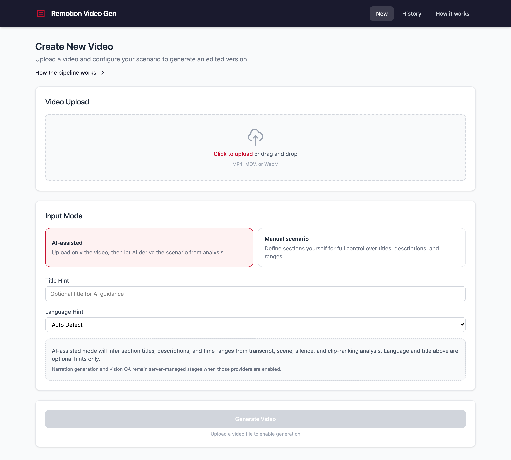
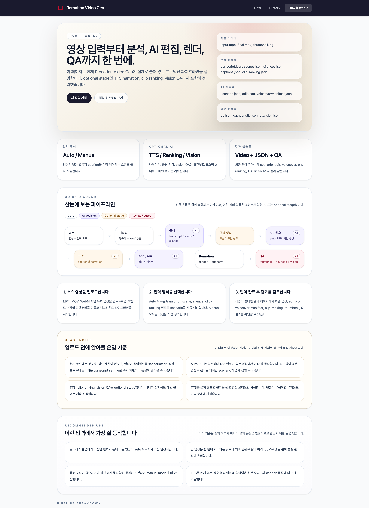
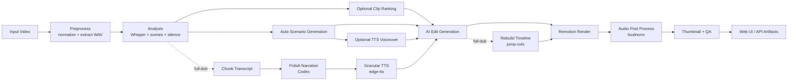

# Remotion Video Gen

[](https://github.com/cyanluna-git/remotion-video-gen)
[](https://www.python.org/)
[](https://nodejs.org/)
[](https://www.remotion.dev/)
[](https://react.dev/)
[](https://fastapi.tiangolo.com/)

Screen recording in, AI-assisted edit pipeline out.

This repository generates edited videos from screen recordings using a staged pipeline built with Remotion, Python analysis scripts, ffmpeg, Whisper, Claude/Codex, and optional multimodal components such as TTS narration, clip ranking, and vision QA. A **full-dub mode** replaces the presenter's voice with polished TTS narration and automatically removes dead air via jump-cut editing.

## TL;DR

- Put in a screen recording
- Let the pipeline analyze, structure, edit, and render it
- Review the final MP4 plus `scenario.json`, `edit.json`, thumbnail, and QA artifacts

## Getting Started In 3 Commands

```bash
pip install -r requirements.txt
npm install --prefix remotion && npm install --prefix web/frontend
./pipeline.sh input.mp4 --auto-scenario --title "Demo Run" --language ko
```

## Screenshots

### Upload flow



### How it works



## What It Does

- Accepts a source recording plus either:
  - a manual `scenario.json`, or
  - an auto-scenario flow driven from analysis artifacts
- Runs preprocessing, transcription, scene detection, silence detection, and caption extraction
- Generates a canonical `scenario.json` and final `edit.json`
- Renders the final video with Remotion
- Produces review artifacts such as:
  - representative thumbnail
  - QA report
  - optional voiceover manifest
  - optional clip-ranking artifact

## Current Pipeline

```text
input video
  -> preprocess (normalize + extract WAV)
  -> analysis (Whisper + scene detect + silence detect)
  -> optional clip ranking
  -> optional auto scenario generation
  -> optional TTS voiceover generation
  -> AI edit generation
  -> Remotion render
  -> loudnorm post-process
  -> thumbnail + QA artifacts
```

### Full-Dub Mode (`--full-dub`)

Replaces the presenter's voice with professional TTS narration and cuts dead air:

```text
input video
  -> preprocess + analysis (same as above)
  -> auto scenario generation (codex)
  -> chunk transcript (~12s segments)
  -> polish narration (codex AI cleanup)
  -> granular TTS (edge-tts per chunk, 40-50 tracks)
  -> AI edit generation (codex)
  -> jump-cut timeline rebuild (pad +-1s, merge gaps)
  -> Remotion render (original audio muted)
  -> loudnorm post-process
```

Typical result: a 7-minute raw recording becomes a 5-minute edited video with consistent TTS narration, bottom captions, and section title cards.

## Architecture



## Demo Surfaces

- Upload and submit a new render job from the web UI
- Inspect the generated `scenario.json`, `edit.json`, and multimodal artifacts
- Review thumbnail and QA output after render
- Browse the built-in pipeline guide at `/how-it-works`

## Repository Layout

```text
.
├── pipeline.sh              # Main end-to-end pipeline
├── scripts/                 # Python analysis, AI generation, and full-dub scripts
├── remotion/                # Remotion render project
├── web/
│   ├── backend/             # FastAPI wrapper around pipeline jobs
│   └── frontend/            # React + Vite job UI
├── scenarios/               # Scenario format docs and examples
├── docs/                    # Multimodal artifact documentation
├── tests/                   # Python and API regression tests
├── jobs/                    # Per-job artifacts (generated)
└── output/                  # Render outputs (generated)
```

## Requirements

- Python 3.12+
- Node.js 20+
- `ffmpeg` / `ffprobe`
- npm

Python dependencies:

```bash
pip install -r requirements.txt
```

Frontend and Remotion dependencies:

```bash
npm install --prefix remotion
npm install --prefix web/frontend
```

## Environment Variables

Only set the providers you need.

```bash
ANTHROPIC_API_KEY=...        # Claude edit/scenario generation
OPENAI_API_KEY=...           # Optional OpenAI TTS / vision QA

CLIP_RANKING_PROVIDER=heuristic

TTS_PROVIDER=                # openai | edge | mock
TTS_MODEL=gpt-4o-mini-tts
TTS_VOICE=alloy              # or en-US-AndrewMultilingualNeural for edge
TTS_AUDIO_FORMAT=wav
TTS_INSTRUCTIONS=

VISION_QA_PROVIDER=          # openai | mock
VISION_QA_MODEL=gpt-4.1-mini
VISION_QA_DETAIL=low
```

## Quick Start

### 1. Run the CLI pipeline with a manual scenario

```bash
./pipeline.sh input.mp4 scenarios/example-oqc-demo.json
```

### 2. Run the AI-assisted pipeline from video only

```bash
./pipeline.sh input.mp4 --auto-scenario --title "Demo Run" --language ko
```

### 3. Full-dub mode (replace voice with TTS + jump-cut editing)

```bash
./pipeline.sh input.mp4 --full-dub --title "Product Demo" --language en
```

This automatically: generates a scenario, chunks the transcript, polishes narration via Codex, generates per-segment TTS (edge-tts), builds the edit script, rebuilds the timeline with jump-cuts, and renders with the original voice muted.

### 4. Full-dub with custom settings

```bash
./pipeline.sh input.mp4 --full-dub --title "Demo" \
  --pad-before 0.3 --pad-after 0.8 --merge-gap 2.0 \
  --tts-voice en-US-GuyNeural
```

### 5. Enable section-level TTS narration (non-full-dub)

```bash
TTS_PROVIDER=edge ./pipeline.sh input.mp4 --auto-scenario
```

### 6. Inspect the Remotion composition locally

```bash
npm --prefix remotion run start
```

## Web App

Start the API server:

```bash
uvicorn web.backend.main:app --reload --host 0.0.0.0 --port 8000
```

Start the frontend:

```bash
npm --prefix web/frontend run dev
```

Open:

- Frontend: `http://localhost:5173`
- How it works page: `http://localhost:5173/how-it-works`
- API docs: `http://localhost:8000/docs`

## Core Artifacts

Typical generated outputs:

- `jobs/<id>/input.mp4`
- `jobs/<id>/scenario.json`
- `jobs/<id>/edit.json`
- `jobs/<id>/voiceover/manifest.json`
- `jobs/<id>/analysis/clip-ranking.json`
- `jobs/<id>/output/final.mp4`
- `jobs/<id>/output/thumbnail.jpg`
- `jobs/<id>/output/qa.json`

## Notes on Limits

- There is currently no hard-coded minute limit in the pipeline.
- In practice, very long videos reduce auto-generation quality because only a capped subset of transcript segments is passed into AI prompt construction.
- Optional stages such as TTS and vision QA do not block the main render path if they fail.
- If voiceover is disabled, the render uses source-video audio only.

## Documentation

- Scenario format: [scenarios/FORMAT.md](scenarios/FORMAT.md)
- Multimodal artifact contracts: [docs/MULTIMODAL_ARTIFACTS.md](docs/MULTIMODAL_ARTIFACTS.md)
- Internal engineering notes: [CLAUDE.md](CLAUDE.md)

## Validation

Useful local checks:

```bash
python3 -m unittest discover -s tests -p 'test_*.py'
python3 -m py_compile scripts/*.py web/backend/main.py
npm --prefix web/frontend run build
npm --prefix web/frontend run lint
```
